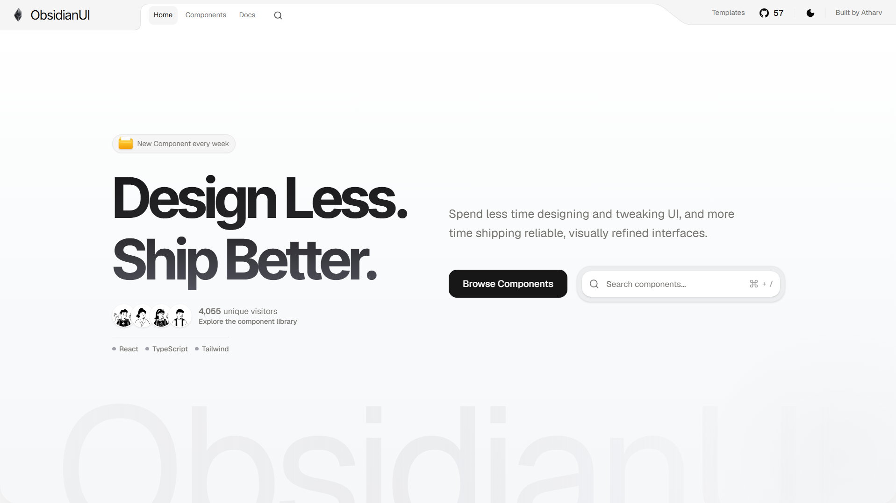
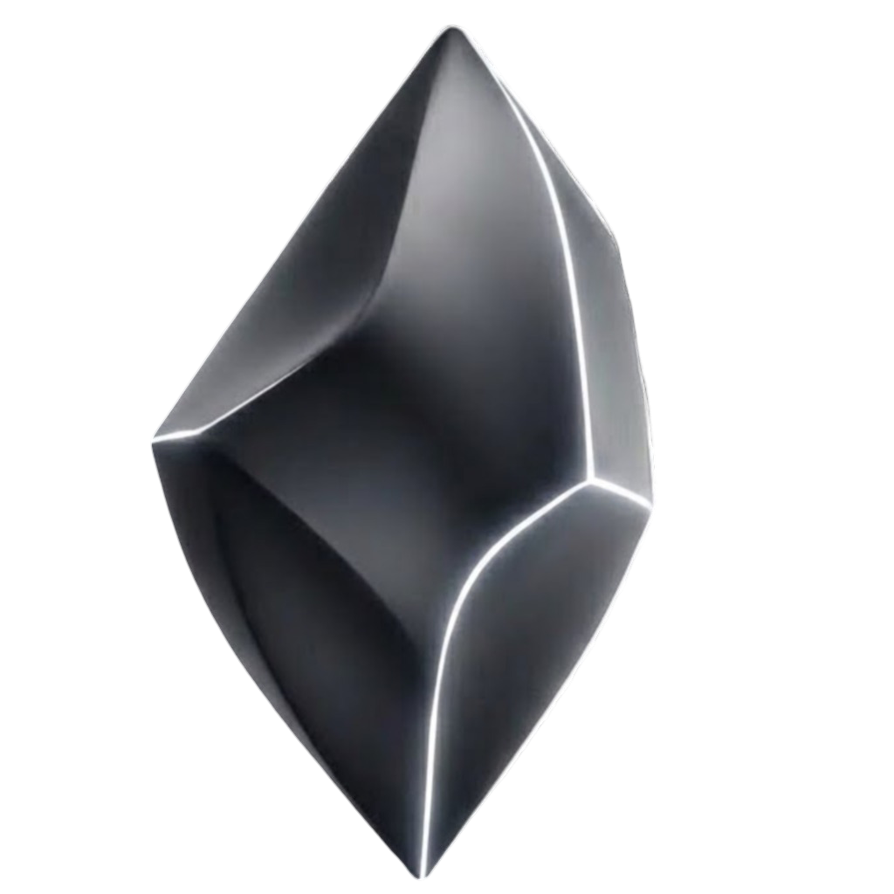

<div align="center">
  <a href="https://www.obsidianui.dev">
    
  </a>
</div>

<div align="center">

# ObsidianUI

**Design Less. Ship Better**  
ObsidianUI is React component library featuring 30+ components, blocks, and landing page templates build with Motion and Tailwind CSS.

<p align="center">
  
  
  
  
  
  
</p>

[**obsidianui.dev**](https://www.obsidianui.dev) &nbsp;&middot;&nbsp; [Components](https://www.obsidianui.dev/components) &nbsp;&middot;&nbsp; [Templates](https://www.obsidianui.dev/templates) &nbsp;&middot;&nbsp; [Documentation](https://www.obsidianui.dev/docs) &nbsp;&middot;&nbsp; [Follow on X](https://x.com/athrix_codes)

</div>

<br />

---

### Highlights & Features

- **35+ Components, Blocks, Landing Pages & Templates**: From fluid cursor effects, 3D book flips, and magnetic image trails to complete landing page templates like Project One.
- **Added AI Agents MCP Server**: Native Model Context Protocol server (`npm run mcp`), `llms.txt`, and markdown endpoints (`Accept: text/markdown`) so AI coding agents (Claude, Cursor, Copilot, Antigravity) can seamlessly discover and install components.
- **Redesigned UI & Design System**: Sleek obsidian dark/light interface, smooth Lenis scrolling, micro-interactions, and accessible motion controls.
- **Zero Lock-in & shadcn CLI Compatible**: 100% owned source code installed directly into your project via `npx shadcn add` or copy-paste, restyled with Tailwind CSS.

---

## Quick start

Install any component directly into your project using the shadcn CLI:

```bash
npx shadcn@latest add "https://www.obsidianui.dev/r/{component-name}.json"
```

### Examples

**Spotlight Card**
```bash
npx shadcn@latest add "https://www.obsidianui.dev/r/spotlight-card.json"
```

**Book Flip Effect**
```bash
npx shadcn@latest add "https://www.obsidianui.dev/r/book-flip.json"
```

**Magnetic Image Trail**
```bash
npx shadcn@latest add "https://www.obsidianui.dev/r/magnetic-image-trail.json"
```

Browse every component, with live interactive previews and props, at [obsidianui.dev/components](https://www.obsidianui.dev/components).

## Running locally

```bash
git clone https://github.com/Atharvsinh-codez/ObsidianUI.git
cd ObsidianUI
npm install
npm run dev
```

Open [localhost:3000](http://localhost:3000) in your browser.

- **Primitives**: `src/components/ui` (shadcn & Radix primitives)
- **Blocks & Effects**: `src/components/block` (interactive effects, canvas, WebGL, shaders, motion components)
- **Documentation**: `src/content` (MDX component guides and examples)

After updating a component or registry source, rebuild the registry output with `npm run registry:build`.

## Commands

| Command | Purpose |
| --- | --- |
| `npm run dev` | Start the local development server |
| `npm run build` | Build the production site, registry manifests, and search index |
| `npm run registry:build` | Rebuild installation manifests from component sources |
| `npm run agent:build` | Rebuild `llms.txt`, Markdown pages, and agent route maps |
| `npm run mcp` | Launch local Model Context Protocol (MCP) server over stdio |
| `npm run lint` | Run ESLint check |
| `npm run typecheck` | Run TypeScript verification |
| `npm test` | Run unit and component test suites |
| `npm run check` | Run lint, types, tests, and production build |

## Contributing

Issues and pull requests are welcome. Read [CONTRIBUTING.md](CONTRIBUTING.md) for the full walkthrough, from creating a component to a working install command.

<div align="center">
  <br />
  
  <p><sub>Built by <a href="https://x.com/athrix_codes">@athrix_codes</a></sub></p>
</div>
